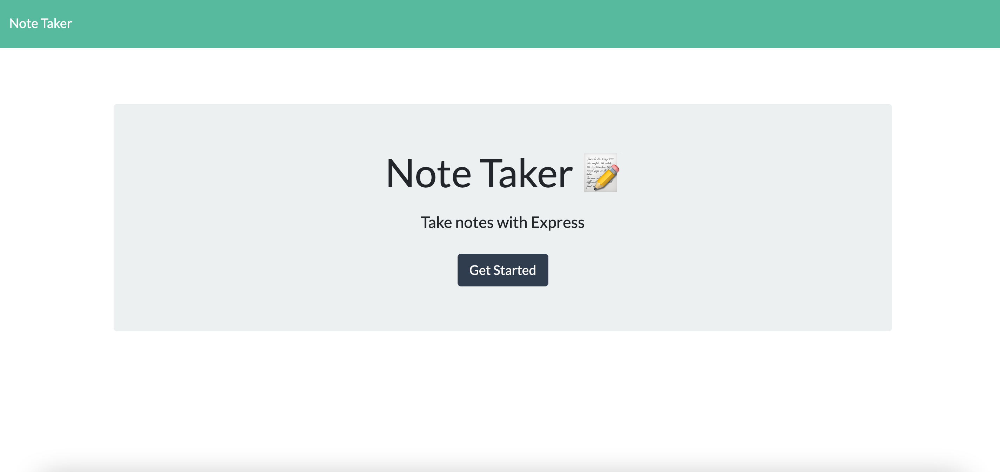

# Note Taker
This is a simple app that allows you take jot down notes that you would like to remind yourself about. This application uses express in the backend which helps save, retrieve, and delete notes to and from a JSON file.

## How to Use

When you enter the site first click on the get started button which will take you to the notes screen. On that screen you will be able to enter whatever note you would like and save so that you can come back and view it later. To enter the site [click here.](https://morning-refuge-89449.herokuapp.com/)

This is what you will first see after the click has been clicked.

To view the code behind this application feel free to visit the repo on [Github.](https://github.com/E-Albert/the-note-taker)